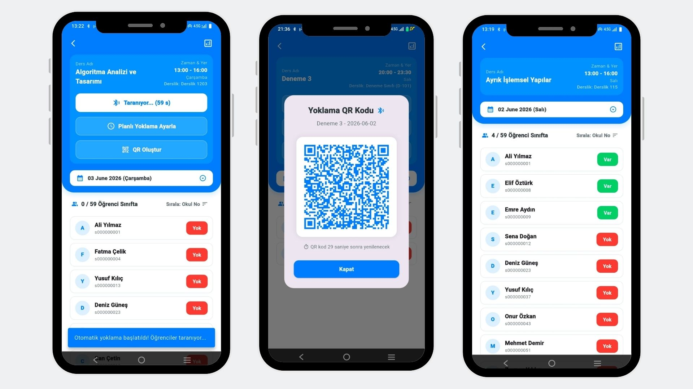
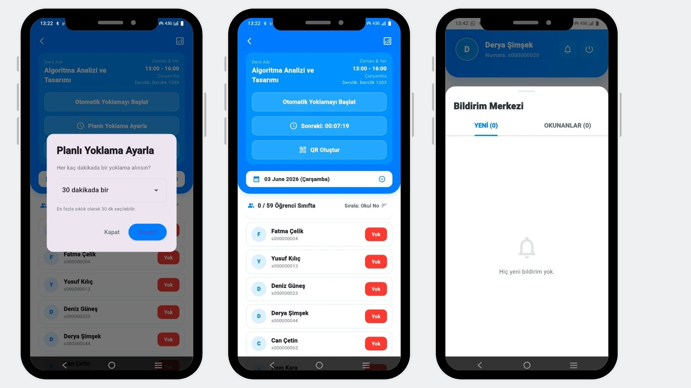
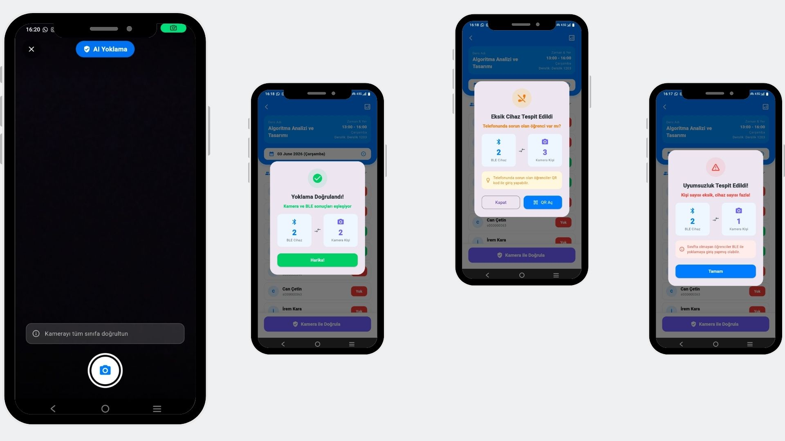
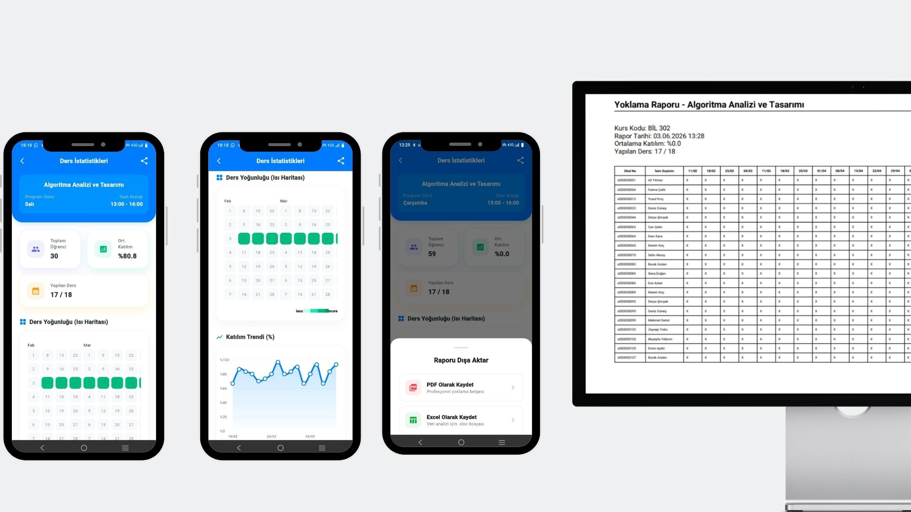
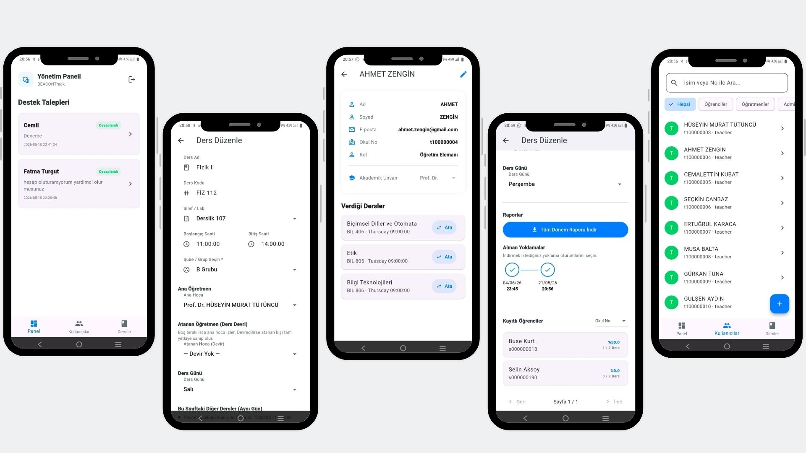
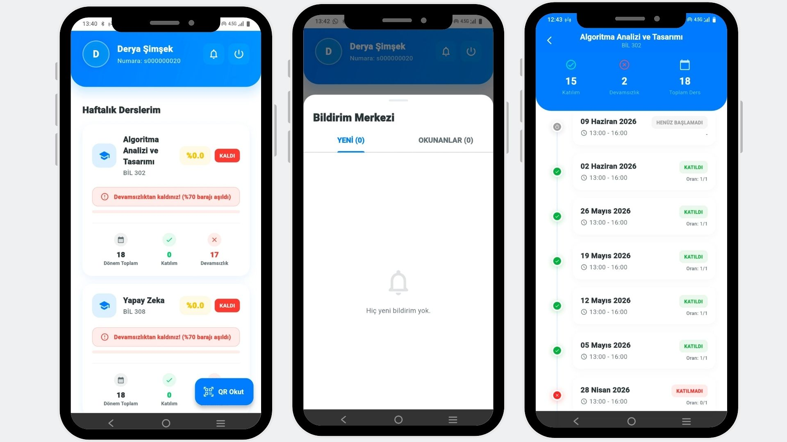

# RollCall

RollCall is a Flutter-based attendance application. It supports student and teacher accounts, QR attendance, BLE beacon attendance, analytics, notifications and an optional Go verification backend.

## Project Visuals


The following screenshots are exported from the project poster and stored in `assets/images/poster/`:

### Teacher attendance and QR code



### Scheduled attendance and notifications



### Camera and BLE verification



### Analytics and attendance report



### Administration panel



### Student screens



## Architecture

| Component | Role | Location |
| --- | --- | --- |
| Flutter app | Mobile UI, QR/BLE attendance and analytics | `lib/` |
| Supabase | Authentication, PostgreSQL, realtime and RPC functions | Supabase project |
| Go backend | Optional verification API and JWT validation | `backend/` |
| ESP32 beacon | BLE scanning and automatic attendance | `hardware/esp32_beacon/` |
| Firebase | Push notifications and analytics | `google-services.json`, `firebase_options.dart` |

## Requirements

- Flutter SDK compatible with Dart `3.10.7` or later
- Android Studio and Android SDK, API level 21 or later
- A Supabase project
- A Firebase project for push notifications
- Go 1.21 or later for the optional backend
- Arduino IDE and ESP32 board support for beacon mode

Check the local installation:

```powershell
flutter doctor
dart --version
```

## Installation and First Run

### 1. Clone the project and install dependencies

```powershell
git clone <REPOSITORY_URL>
cd rollcall
flutter clean
flutter pub get
flutter devices
```

Replace `<REPOSITORY_URL>` with the repository URL. Do not commit `backend/config/.env` or any service-role key.

### 2. Set up Supabase

1. Create a project at [supabase.com](https://supabase.com/).
2. Copy the project URL and publishable/anon key from **Project Settings > API**.
3. Open **SQL Editor** and run the base schema.
4. Run every file in `backend/database/migrations/` in numeric order: `001` through `009`.
5. Enable **Authentication > Providers > Email**.
6. Create test users and matching rows in `users` with the role `student`, `teacher` or `admin`.

Important tables and functions are `users`, `courses`, `student_courses`, `attendance`, `notifications`, `classrooms`, `verification_logs`, `attendance_sessions` and `mark_attendance_by_hash`.

Keep RLS policies, RPC permissions and column names compatible with the Flutter queries. The `service_role` key is server-only and must never be placed in Flutter or ESP32 code.

### 3. Run the Flutter application

```powershell
flutter run --dart-define=SUPABASE_URL=https://YOUR_PROJECT.supabase.co --dart-define=SUPABASE_ANON_KEY=YOUR_PUBLISHABLE_OR_ANON_KEY
```

Build an Android APK with:

```powershell
flutter build apk --release --dart-define=SUPABASE_URL=https://YOUR_PROJECT.supabase.co --dart-define=SUPABASE_ANON_KEY=YOUR_PUBLISHABLE_OR_ANON_KEY
```

The values are read in `lib/main.dart`. The fallback values in that file are for development only; prefer `--dart-define` for each deployment.

### 4. Set up Firebase

1. Create or select a Firebase project.
2. Register the same Android package name as the one in `android/app/build.gradle.kts`.
3. Download the matching `google-services.json` into `android/app/`.
4. If the Firebase project changes, regenerate `lib/firebase_options.dart`:

```powershell
dart pub global activate flutterfire_cli
flutterfire configure
```

Enable Firebase Cloud Messaging and test notifications on a physical device. The package name, `google-services.json` and `firebase_options.dart` must belong to the same Firebase project.

### 5. Run the Go backend (optional)

```powershell
cd backend
Copy-Item config/.env.example config/.env
```

Set these values in `backend/config/.env`:

```dotenv
SUPABASE_URL=https://YOUR_PROJECT.supabase.co
SUPABASE_ANON_KEY=YOUR_PUBLISHABLE_OR_ANON_KEY
SUPABASE_SERVICE_ROLE_KEY=YOUR_SERVICE_ROLE_KEY
PORT=8080
GIN_MODE=debug
```

Start the API:

```powershell
go mod download
go run ./cmd/server
```

The health check is available at `http://localhost:8080/api/health`. A physical phone cannot use its own `localhost`; use the computer's LAN IP and allow port `8080` through the firewall.

### 6. Configure the ESP32 beacon (optional)

In `hardware/esp32_beacon/rollcall_beacon/rollcall_beacon.ino`, customize `ssid`, `password`, `supabaseHost`, `supabaseKey`, `classroomId`, `gmtOffset_sec`, `SCAN_DURATION` and `MIN_RSSI`. Install ESP32 board support and the required BLE/Wi-Fi libraries in Arduino IDE, select the board and port, then upload the sketch.

The classroom UUID and beacon major/minor values must match the records created in Supabase. Use only the publishable/anon key on the ESP32, never the service-role key.

## Customization Checklist

| Area | What to change | Location |
| --- | --- | --- |
| Supabase | URL, publishable key, schema, RLS and RPCs | `lib/main.dart`, Supabase SQL Editor |
| Backend secrets | Anon key, service-role key, port and mode | `backend/config/.env` |
| Firebase | Project, package name and notification settings | `google-services.json`, `firebase_options.dart` |
| Android release | App ID, signing config and keystore | `android/app/build.gradle.kts` |
| Branding | App icon, app name and poster screenshots | `assets/images/`, Android/iOS metadata |
| Beacon | Wi-Fi, classroom UUID, beacon values and RSSI | ESP32 `.ino`, Supabase classrooms |

## Common Problems

- **Supabase permission denied:** Check the user role and RLS policies; do not expose the service-role key.
- **Firebase initialization error:** Check the package name, `google-services.json` and `firebase_options.dart`.
- **No beacon attendance:** Check Bluetooth/location permissions, Wi-Fi, classroom UUID, major/minor values and RSSI.
- **Phone cannot reach the API:** Replace `localhost` with the development computer's LAN IP.
- **Migration or RPC error:** Run migrations in numeric order without skipping files.

## Useful Commands

```powershell
flutter analyze
flutter test
```

```powershell
cd backend
go test ./...
```

## License

Add the project license and contribution rules here when they are decided.

---

# Türkçe

RollCall; öğrenci ve öğretmen hesaplarını, QR ile yoklamayı, BLE beacon ile yoklamayı, analiz ekranlarını, bildirimleri ve isteğe bağlı Go doğrulama backend'ini destekleyen Flutter tabanlı bir yoklama uygulamasıdır.

## Proje Görselleri


Poster dosyasından dışa aktarılan ve `assets/images/poster/` klasöründe bulunan gerçek görseller aşağıdadır.

### Öğretmen yoklama ve QR kodu


### Planlı yoklama ve bildirimler


### Kamera ve BLE doğrulaması


### Analiz ve yoklama raporu


### Yönetim paneli


### Öğrenci ekranları


## Mimari

| Bileşen | Görevi | Konum |
| --- | --- | --- |
| Flutter uygulaması | Mobil arayüz, QR/BLE yoklama ve analiz | `lib/` |
| Supabase | Kimlik doğrulama, PostgreSQL, realtime ve RPC fonksiyonları | Supabase projesi |
| Go backend | İsteğe bağlı doğrulama API'si ve JWT kontrolü | `backend/` |
| ESP32 beacon | BLE tarama ve otomatik yoklama | `hardware/esp32_beacon/` |
| Firebase | Anlık bildirimler ve analitik | `google-services.json`, `firebase_options.dart` |

## Gereksinimler

- Dart `3.10.7` veya üzeri ile uyumlu Flutter SDK
- Android Studio ve Android SDK, API seviyesi 21 veya üzeri
- Bir Supabase projesi
- Anlık bildirimler için bir Firebase projesi
- İsteğe bağlı backend için Go 1.21 veya üzeri
- Beacon modu için Arduino IDE ve ESP32 kart desteği

Yerel kurulumu kontrol edin:

```powershell
flutter doctor
dart --version
```

## Kurulum ve İlk Çalıştırma

### 1. Projeyi indirin ve bağımlılıkları yükleyin

```powershell
git clone <REPOSITORY_URL>
cd rollcall
flutter clean
flutter pub get
flutter devices
```

`<REPOSITORY_URL>` yerine repository adresini yazın. `backend/config/.env` dosyasını veya herhangi bir service-role anahtarını Git'e göndermeyin.

### 2. Supabase'i kurun

1. [supabase.com](https://supabase.com/) üzerinden bir proje oluşturun.
2. **Project Settings > API** bölümünden proje URL'sini ve publishable/anon anahtarını kopyalayın.
3. **SQL Editor** bölümünü açın ve ana şemayı çalıştırın.
4. `backend/database/migrations/` klasöründeki dosyaları `001` ile `009` arasında numara sırasıyla çalıştırın.
5. **Authentication > Providers > Email** seçeneğini etkinleştirin.
6. Test kullanıcıları oluşturun ve `users` tablosunda bu kullanıcılara `student`, `teacher` veya `admin` rolü verin.

Uygulamanın kullandığı önemli tablo ve fonksiyonlar: `users`, `courses`, `student_courses`, `attendance`, `notifications`, `classrooms`, `verification_logs`, `attendance_sessions` ve `mark_attendance_by_hash`.

RLS politikalarını, RPC izinlerini ve kolon adlarını Flutter sorgularıyla uyumlu tutun. `service_role` anahtarı yalnızca server tarafında kullanılmalı, Flutter veya ESP32 koduna kesinlikle eklenmemelidir.

### 3. Flutter uygulamasını çalıştırın

```powershell
flutter run --dart-define=SUPABASE_URL=https://YOUR_PROJECT.supabase.co --dart-define=SUPABASE_ANON_KEY=YOUR_PUBLISHABLE_OR_ANON_KEY
```

Android APK oluşturmak için:

```powershell
flutter build apk --release --dart-define=SUPABASE_URL=https://YOUR_PROJECT.supabase.co --dart-define=SUPABASE_ANON_KEY=YOUR_PUBLISHABLE_OR_ANON_KEY
```

Değerler `lib/main.dart` dosyasında okunur. Bu dosyadaki varsayılan değerler yalnızca geliştirme içindir; her deployment için `--dart-define` kullanın.

### 4. Firebase'i kurun

1. Bir Firebase projesi oluşturun veya mevcut projeyi seçin.
2. `android/app/build.gradle.kts` dosyasındaki Android paket adıyla aynı paketi Firebase'e kaydedin.
3. Uyumlu `google-services.json` dosyasını `android/app/` klasörüne indirin.
4. Firebase projesi değişirse `lib/firebase_options.dart` dosyasını yeniden oluşturun:

```powershell
dart pub global activate flutterfire_cli
flutterfire configure
```

Firebase Cloud Messaging'i etkinleştirin ve bildirimleri fiziksel bir cihazda test edin. Paket adı, `google-services.json` ve `firebase_options.dart` aynı Firebase projesine ait olmalıdır.

### 5. Go backend'ini çalıştırın (isteğe bağlı)

```powershell
cd backend
Copy-Item config/.env.example config/.env
```

`backend/config/.env` dosyasına şu değerleri girin:

```dotenv
SUPABASE_URL=https://YOUR_PROJECT.supabase.co
SUPABASE_ANON_KEY=YOUR_PUBLISHABLE_OR_ANON_KEY
SUPABASE_SERVICE_ROLE_KEY=YOUR_SERVICE_ROLE_KEY
PORT=8080
GIN_MODE=debug
```

API'yi başlatın:

```powershell
go mod download
go run ./cmd/server
```

Sağlık kontrolü `http://localhost:8080/api/health` adresindedir. Fiziksel telefon kendi `localhost` adresini kullanır; bu nedenle bilgisayarın yerel ağ IP adresini kullanın ve 8080 portuna güvenlik duvarından izin verin.

`SUPABASE_SERVICE_ROLE_KEY` yalnızca backend secret olarak tutulmalıdır; Flutter'a, ESP32'ye veya Git'e koymayın.

### 6. ESP32 beacon'i yapılandırın (isteğe bağlı)

`hardware/esp32_beacon/rollcall_beacon/rollcall_beacon.ino` dosyasında `ssid`, `password`, `supabaseHost`, `supabaseKey`, `classroomId`, `gmtOffset_sec`, `SCAN_DURATION` ve `MIN_RSSI` değerlerini değiştirin. Arduino IDE'ye ESP32 kart desteğini ve gerekli BLE/Wi-Fi kütüphanelerini kurun; kartı ve portu seçip kodu yükleyin.

Sınıf UUID'si ve beacon major/minor değerleri Supabase'deki kayıtlarla aynı olmalıdır. ESP32 üzerinde yalnızca publishable/anon anahtar kullanın; service-role anahtarını kesinlikle kullanmayın.

## Özelleştirme Kontrol Listesi

| Alan | Değiştirilecekler | Konum |
| --- | --- | --- |
| Supabase | URL, publishable anahtar, şema, RLS ve RPC'ler | `lib/main.dart`, Supabase SQL Editor |
| Backend secret'ları | Anon anahtarı, service-role anahtarı, port ve mod | `backend/config/.env` |
| Firebase | Proje, paket adı ve bildirim ayarları | `google-services.json`, `firebase_options.dart` |
| Android sürümü | Uygulama ID'si, imzalama ayarları ve keystore | `android/app/build.gradle.kts` |
| Marka ve görseller | Uygulama ikonu, uygulama adı ve poster görselleri | `assets/images/`, Android/iOS metadata |
| Beacon | Wi-Fi, sınıf UUID'si, beacon değerleri ve RSSI | ESP32 `.ino`, Supabase classrooms |

## Sık Karşılaşılan Sorunlar

- **Supabase permission denied:** Kullanıcı rolünü ve RLS politikalarını kontrol edin; service-role anahtarını açığa çıkarmayın.
- **Firebase başlatma hatası:** Paket adını, `google-services.json` ve `firebase_options.dart` dosyalarını kontrol edin.
- **Beacon yoklaması oluşmuyor:** Bluetooth/konum izinlerini, Wi-Fi'yi, sınıf UUID'sini, major/minor değerlerini ve RSSI eşiğini kontrol edin.
- **Telefon API'ye ulaşamıyor:** `localhost` yerine geliştirme bilgisayarının yerel ağ IP'sini kullanın.
- **Migration veya RPC hatası:** Migration dosyalarını atlamadan numara sırasıyla çalıştırın.

## Yararlı Komutlar

```powershell
flutter analyze
flutter test
```

```powershell
cd backend
go test ./...
```

## Lisans

Proje lisansı ve katkı kuralları belirlendiğinde bu bölüme eklenmelidir.